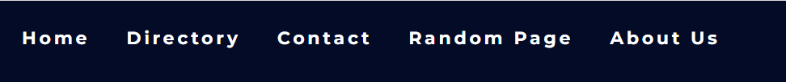
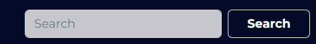
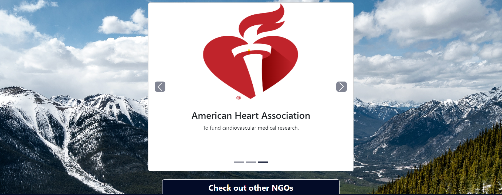
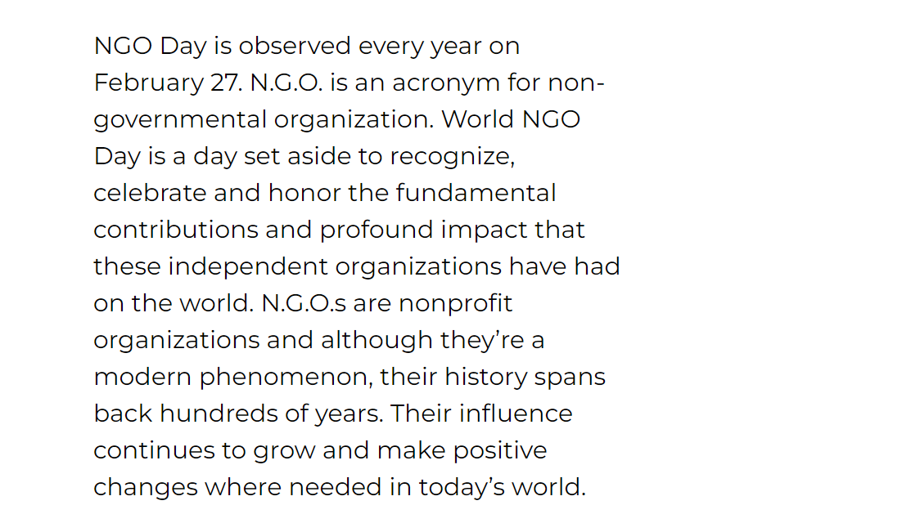
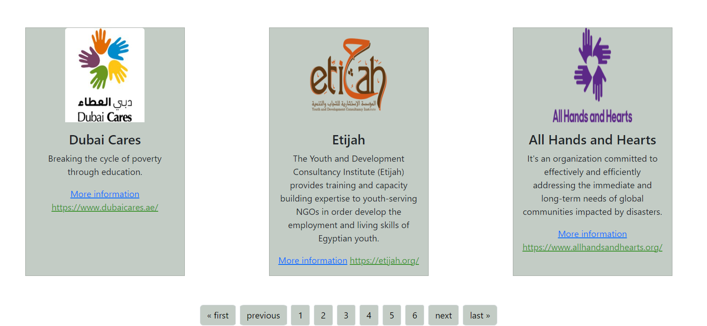
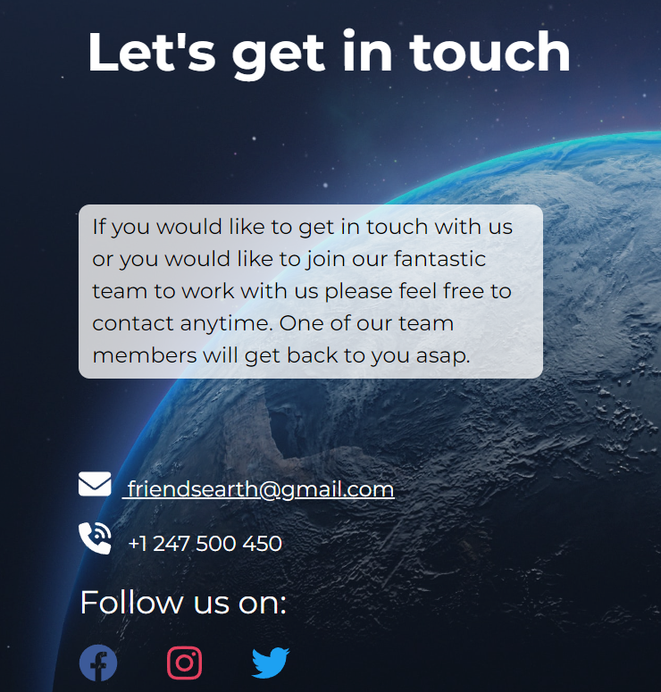
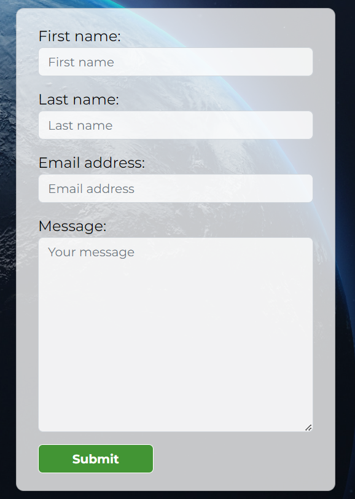
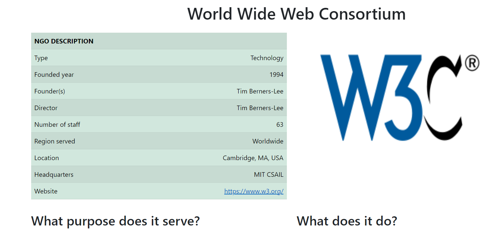
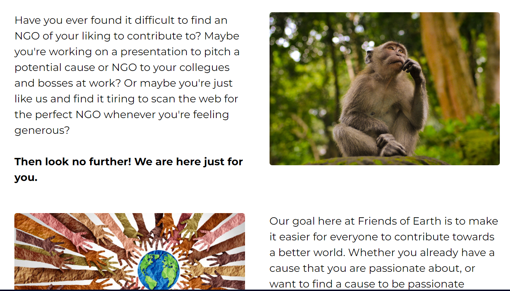

# Feb 2023 hackathon

# NGO Directory

# Project Documentation
## Welcome to [NGO Directory](https://feb-2023-hackathon.herokuapp.com/)

## Mission
The mission of our website is to act as an NGO directory, where users can find information about many different NGOs worldwide, and be directed to more information about each one if they choose. It is easy it is simple, all in one website. The present documentation will provide information to understanding the core design principles that enabled the development of the project. More specifically, details regarding the UX/UI development, application testing and deployment, bug fixes and the planned future features for the project.

## [Link to website](https://feb-2023-hackathon.herokuapp.com/)
---
# Table of Contents

- [The Story](#the-story)
- [Scrum Master](#scrum-master)
- [User Experience (UX)](#user-experience-ux)
    - [Target audiance](#target-audiance)
    - [User Stories](#user-stories)
- [Wireframes](#wireframes)
- [Features](#features)
- [Technologies Used](#technologies-used)
- [Design choices](#design-choices)
    - [Colour palette](#colour-palette)
    - [Font](#font)
- [Deployment](#deployment)
- [Bugs](#bugs)
- [Testing](#testing)
- [Credits](#credits)

# The story

This project is part of the Code Institute February 2023 Hackathon. We researched World NGO Day and found that it aims to appreciate different NGOs across the world, and so decided that having a directory where users can browse different NGOs, would help users to find more specific information or bring awareness to different NGOs. It can also help users to find NGOs which they would like to be a part of or contribute towards.

**Repository:** [https://github.com/AdamBoley/Feb-2023-Hackathon](https://github.com/AdamBoley/Feb-2023-Hackathon)

**Final website:** [https://feb-2023-hackathon.herokuapp.com/](https://feb-2023-hackathon.herokuapp.com/)

# Scrum Master

As a Scrum Master our team had [Edmir Demaj](https://www.linkedin.com/in/edmir-demaj-42a501196/). As a Scrum Master my duties are:
- Work on Project idea together with the team.
- Plan how team members will work on this project.
- Keep notes for any suggestions, ideas, and changes on the project. 
- Find out which technologies will be used on this project to involve the whole team.
- Organise meetings via Slack for the team at suitable times for everyone.
- Provide a summary after each call on our Slack channel.
- Create and assign tasks to team members.
- Check the progress of each one at the end of day.
- Check the progress of the project to deploy before the deadline.
- Create a sprint goal for user stories, create To Do tasks and check their progress.
- Assist in any problems during project development.
- Make sure the product achieves its final goals.

Since this project is part of Hackathon February 2023 and the time is very limited to have a detailed plan, progress and final report all I could do is to implement all duties mentioned above. Below find the project board built on GitHub and the Sprint Goal made for user stories.

Project board on GitHub

Sprint Goal

---

# User Experience UX

## Target Audiance

This project is aimed at anyone who wants to know more about NGOs worldwide. If the user wants to find out more or contribute directly to a specific NGO, they can find the link to take them directly to the NGO website itself.

## User Stories

- To immediately determine the purpose of the site, so the user can quickly decide whether or not to stay.
- To be able to see a clear contrast between foreground and background.
- To be able to easily access the site on a variety of devices - desktop, tablet, mobile.
- To be able to browse a variety of different NGOs in one place.
- To be able to read an overview of each NGO, e.g., purpose, founder and date it was founded, current director, location, etc.
- To be able to visit each NGO's website directly (opens in new tab).
- To be able to get random NGOs if i dont know what to search for.
- To find out information about World NGO day and when it is.
- To be able to search by the name of an NGO.
- To be able to contact someone from the team if more detailed information is desired.
- To be able to leave a message or any inquiries one might have as a user.
- To be able to understand what this site is about.
- To be able to easily access contact details or social media pages.

# Wireframes

Created using [Figma](https://www.figma.com/) (click to expand)

Homepage

About page

NGOs page

Contact page

# Features

### Logo

- Features an image of the Earth above the site name, 'Friends of Earth'.
- Uses green colours in-keeping with the site colour scheme and tying to nature and the Earth.

### Navigation menu

- At the top of every page allows for easy site navigation.
-  Makes it clear to the user how they can access different pages or to return to a previous page without relying on browser forward/back buttons.

### Search bar

- Allows users to search for a specific element on the website, e.g., if they are looking for information on a particular NGO.

### Homepage

- Displays a slideshow of three random NGOs from the directory, above a button to check out more NGOs which takes the user to the directory page. This is above the fold so it is the first thing a user will see when visiting the site.
- Slideshow is over a hero image of a landscape, which clearly relates to the site name 'Friends of Earth' and also to environmental NGOs.
- It also features a short explanation of World NGO Day - when it is and what NGOs are.

### Directory (NGOs) page

- Each page features a brief overview of six different NGOs, including:
    - Name
    - Logo
    - Brief description
    - Internal link to more information on our site
    - External link to the NGO's site (opens in a new tab so the user can easily navigate back to our site)
- The user can navigate between the directory pages by using the 'first', 'previous', 'next' and 'last' buttons at the bottom of the screen.

### Contact page

- Features a short description of reasons a user might want to get in touch with us.
- Provides various contact details - phone number, email address and Google Maps location, as well as links to social media sites.
- User can fill out a form with their contact details and message, which will go to our database and allows us to get in touch with them to reply.
- Contact details and form are over a hero image of the Earth as seen from space, again relating to the site name 'Friends of Earth' but a different take on it, to provide variety and also to focus more on the worldwide/global aspect of the site.

### Random page

- Takes the user to a page with information about a random NGO in our database.

### About us page

- Explains who we are and why our website was created, along with images relating to different types of NGO.

### Footer

- Features Copyright, team name and social media links to feature at the bottom of every page.

### Favicon

- Favicon is generated using favicon.io.
- It was made using the site logo.

# Function

This section documents how Django was used to set up the project

## Models

The project's `models.py` file contains 2 models - NGO and Message.

### NGO

The NGO model is the primary model for the project, used to store information about Non-Governmental Organisations. It has several fields.

- name, a CharField, for recording the name of the NGO
- type, an IntegerField with choices supplied by an external tuple of tuples, for recording the sector the NGO operates in
- founded, a DateField, for recording the founding date of the NGO
- founders, a CharField, for recording the person or persons who set up the NGO
- director, a CharField, for recording the current director of the NGO
- staff, an IntegerField, for recording the number of direct employees of the NGO
- region, an IntegerField with choices supplied by an external tuples of tuples, for recording the region in which the NGO operates
- location, a CharField, for recording the location where the NGO is based
- headquarters, a Charfield, for recording the address of the headquarters of the NGO
- website, a URLField, for recording the website of the NGO 
- image, a CloudinaryField, for uploading an image of the NGO, such as a logo
- purpose, a CharField, for recording the stated purpose of the NGO
- description, a TextField, for recording what the NGO does

### Message

The Message model is a secondary model for the project. It is not directly used, but is instead used to dynamically generate a form for accepting user input via the Contact page. It has 4 fields:
- first_name, a CharField for recording a user's first name
- last_name, a CharField, for recording a user's second name
- email_address, an EmailField, for recording a user's email address
- message, a TextField, for recording a user's message

## Forms

The project's `forms.py` file contains the MessageForm class, which is a companion to the Message model. It is used to create a form for use in the Contact page View. This form is modified to use the Bootstrap form-control class, which makes the form nice to use.

## Views

The project's `views.py` file contains the Views necessary to render the project's pages. These are several views:

### LandingPage
The LandingPage view constructs a queryset from 3 rows of the NGO table, and renders the landing page from the `index.html` template

### NGO Directory
The NGO_Directory view constructs a queryset from all rows of the NGO table, and renders the directory page from the `ngo_directory.html` template

### NGO Single
The NGO_single view handles the rendering of a page that displays all of the information regarding a single NGO. It uses the `ngo_single.html` template

### NGO Random
The NGO_Random view works similarly to the NGO_Single view, except that it selects a random row from the NGO table.

### SearchResults
The SearchResults view handles the response to a user's search using the search bar. It matches user-supplied terms to fields in the NGO table, and displays records that match those terms. It renders the search_results page using the `search_results.html` template

### Contact
The Contact view renders the Contact page using the `contact.html` template. The Contact view also injects the MessageForm, and handles submission of that form.

### About
The About view renders the About page using the `about.html` template.

### 404 and 500

These views handle the app's response to HTTP 404 and 500 errors

## URLS
The project's `urls.py` file contains all URL paths.

## Admin
The project's `admin.py` is used to register the NGO and Message models in the admin panel. It applies the Summernote Rich Text Editor to the admin panel.

# Technologies Used

### Languages:
  * Python
  * HTML
  * CSS

### Tools and Frameworks
  * GitHub, host platform and version control
  * Gitpod, IDE write and edit code
  * Django, Python Framework
  * Bootstrap, CSS framework
  * Figma, create wireframes

# Design choices

## Colour palette

The chosen colour palette is symbolic of the Earth and uses complementing blues, green, grey and white:

## Font
The chosen font is Jomolhari & Montserrat. Jomolhari is used for Nav links and MOntserrat for content.
The font is white over the darker background of the header and footer, and dark over white and light backgrounds in the main body of each page to make sure it is accessible and can be easily read by users.

# Deployment
- This site was developed in IDE (Gitpod)[https://www.gitpod.io/] and deployed to (Heroku)(https://www.heroku.com/)]
- GitHub is used for version control and hosting platform for the site.
- It was built using the Django framework.
- The site was developed by previewing the site in the browser through Port 8000 in Gitpod by running the command `python3 manage.py runserver` in the terminal.

Changes and entries to the workspace were then committed and pushed to this Github repository.
### Setting up the project in Gitpod workspace:
1. Install django by running the following command `pip3 install Django`
2. Install gunicorn for running the deployed website `pip3 install gunicorn`
3. To install postgres to support the database `pip3 install dj_database_url pyscopg2`
4. Install any other required libraries by running similar commands and add them to a requirements.txt file so that Heroku will install them at deployment. This is done by running `pip3 freeze --local > requirements` in the terminal and can be run again when necessary to add further libraries.
5. Create your Django project by entering the following command: `django-admin startproject < YOUR PROJECT NAME >`
6. To create a django app, run `python manage.py startapp < YOUR APP NAME >`
7. Add the name of the newly created app to "INSTALLED_APPS" in settings.py.
8. Development of apps can begin from here.
### Deploying to Heroku
1. Once logged into Heroku, choose the option 'Create App'.
2. Attach the database in the Resources tab in Add-ons. Search for 'Heroku Postgres' and add.
3. In your workspace, create an env.py file which will store environment variable and add it to .gitignore so as not to expose any sensitive information publicly in Github.
4. Store your 'SECRET_KEY' and 'DATABASE_URL' here and import into settings.py
5. In Heroku, under settings, choose 'Reveal Config Vars and add your 'SECRET_KEY' and 'DATABASE_URL'.
6. Migrate to the database in Gitpod using `python manage.py makemigrations` followed by `python manage.py migrate`
7. Add your Heroku app URL to "ALLOWED_HOSTS" in settings.py.
8. Create a Procfile in the top level of the directory and add `web: gunicorn projectname.wsgi` so Heroku knows how to run the project.
### Initial deployment:
1. Push any changes to Github after connecting your Heroku app to your repository.
2. Add DISABLE_COLLECTSTATIC with a value of 1 to Heroku config vars.
3. Select Github in Deployment method and choose 'Deploy branch' under Manual Deploy, ensuring your main branch is chosen.

# Bugs
Several minor busg were encountered throughout development, mostly related to front-end styling with Bootstrap.

# Testing
A number of manual tests were carried out on this project:
- All nav links on nav bar work.
- Search bar works showing the results.
- External links work.
- Data from database is provided to user.
- Contact form send data to database.
- Website has been tested with google lighthouse and the result is as below.

# Credits

- All images were taken using free copyrights sites [Pexels](https://www.pexels.com/) and [Unsplash](https://unsplash.com/)
- Content on home page was taken from [National Today](https://nationaltoday.com/world-ngo-day/)
- Data to populate database with NGOs was taken from [Google](https://www.google.com/)

# Acknowledgements

- Thank you to all the team member for the hard work and cooperation.
  - Edmir Demaj - [GitHub](https://github.com/Edmir-Demaj), [LinkedIn](https://www.linkedin.com/in/edmir-demaj-42a501196)
  - Maria Jones - [GitHub](https://github.com/mariacjones1), [LinkedIn](https://www.linkedin.com/in/maria-jones-69727a12b/)
  - Adam Boley - [GitHub](https://github.com/AdamBoley), [LinkedIn](https://www.linkedin.com/in/adam-boley-196420a8/)
  - Alexander Glemme - [GitHub](https://github.com/alexanderglemme), [LinkedIn](https://www.linkedin.com/in/alexander-glemme/)
  - Maximiliane Kaempffer - [GitHub](https://github.com/Maximiliane-K), [LinkedIn](https://www.linkedin.com/in/maximiliane-kaempffer/)
  - Liam Pewton - [Github](https://github.com/lpewton), [LinkedIn](http://www.linkedin.com/in/liam-pewton-54b496172)
  - Linus Berger - [GitHub](https://github.com/Linber93), [LinkedIn](https://www.linkedin.com/in/linus-berger-81a484216)

# Particular Callouts

This section will call out each team member for a particularly valuable contribution to the project
- Linus was able to implement the carousel on the Index page, which cycles through 3 rows of the NGO table (he also single-handedly broke Sweden's tech industry)
- Liam came up with the novel idea of injecting fields from the NGO table into an HTML table. This gives a structured look to the NGO Single page
- Maximiliane populated the database almost single-handedly, providing the team with records to inject into the app
- Edmir was invaluable as Scrum Master
- Alexander proved to be an excellent front-end designer with Bootstrap
- Adam set up the Django framework, and provided assistance with debugging and Bootstrap
- Maria was excellent in documenting the project

# Thank you !
 [Back to Top](#table-of-contents)
 
  
